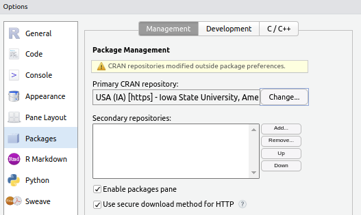

```{r setup, include=FALSE}
pacman::p_load(formatR, countdown, fontawesome, learnr)
knitr::opts_chunk$set(
  echo = TRUE, error = TRUE,
  fig.width=3,fig.height=3,
  out.width = "100%"
)
custom_checker <- function(check_code, evaluate_result, last_value, ...){
   check_result <- eval(parse(text=check_code))
   if(all.equal(last_value, check_result)){
      list(message = learnr::random_praise(), correct = TRUE, location = "append")
   } else {
      list(message = learnr::random_encouragement(), correct = FALSE, location = "append")
   }
}
learnr::tutorial_options(
  exercise.cap = 'baser',
  exercise.checker = custom_checker
)
question <- function(title, ...) {
  learnr::question(
    title, ..., random_answer_order=T, allow_retry=T
  )
}
```

```{js, echo=FALSE}
$(function() {
   $('.ace_editor').each(function( index ) {
     ace.edit(this).setFontSize("18px"); // change editor fontsize
   });
})
```
```{css, echo=FALSE}
a:hover { color: red;  }
body, .ace-tm {
    /* font-family: "Ubuntu Mono", "DejaVu Sans Mono", "Kaiti SC", "Kaiti TC", STKaiti, "Kai", BiauKai, "AR PL UKai CN", "AR PL UKai HK", "AR PL UKai TW", "AR PL UKai TW MBE", "AR PL KaitiM GB", KaiTi, KaiTi_GB2312, DFKai-SB, "TW\-Kai", monospace !important; */
    font-size: 20px;
}
label { display: flex !important; align-items: center}
label > span {padding-left: 5px; }
label > input {top: unset !important; }
.tutorialTitle { color: #91a01e; }
h2 { color: #ed1f7f; font-size: 2em; }
h3 { color: #005587; font-size: 1.5em; }
details > summary { display: list-item; }
details {
    border: 1px solid #aaa;
    border-radius: 0.2rem;
    padding: 0.5em 0.5em 0;
}
```

------------

## 学习目标
>
> * 了解R和Rstudio的基本使用
> * 理解向量, 列表和数据表三种基础的R语言数据结构
> * 正确理解关系运算符(relational operators)和逻辑运算符(logical operators)
> * 正确理解条件控制及循环控制语句, 理解向量化运算
> * 正确创建和调用函数

--------------

## 基本操作

>
> * 工作目录
> * 查看和删减变量
> * 包的安装和使用
> * 使用帮助命令
> * 基本运算符号

### 工作目录

通常, 程序有两种读取文件的方法: 一种是通过绝对路径, 即使用文件的完整路径来读取文件; 另一种是通过相对路径, 即相对于你设定的工作目录来读取文件. 

```{r exercise-getwd, exercise=TRUE}
getwd()          # 返回当前工作目录
setwd("c://...") # 将工作目录设置为
```

这样当你使用快捷键`Ctrl + Shift + p`, 创建**R**脚本(create new R script)和文件夹(create new folder)时, 都是基于你设定的这个工作路径下

<details><summary>补充知识: 如何用命令行创建文件及文件夹</summary>

```{r exercise-file, exercise=TRUE}
# 我们可以调用R-base package的函数实现文件的创建/重命名/删除等
?file.create
?file.copy
?dir.create
?list.files
?file.remove
?unlink
```
</details>

### 创建变量

要将任何函数/变量等保存到当前的`R session environment`(Rstudio右下角的Environment/Global Environment), 请使用赋值运算符`<-` (快捷键: Windows下的`alt + -` or Mac下的`option + -`)

```{r exercise-variable, exercise=TRUE}
x <- 1
(x <- 2)  
```

- 变量名可以包含字母, 数字, 句点或下划线, 但并且必须以字母开头
- R 区分大小写: 因此 object, OBJECT 和 ObJeCt 会被视为不同的变量
- 单个等号`=`也可以用于赋值, 但建议在R中使用快捷键`<-`完成赋值, 在调用函数的传参中使用`=`
- 加括号代表完成赋值并打印, `(x <- 1)`的效果等同于`x <- 1; x`
- 我们在课上介绍了两种比较常用的变量命名规范: **snake_case** 和 **camelCase**, 请掌握这两种变量命名范式

```{r quiz_variable, echo = FALSE}
question(
  "下列哪些是有效的变量名, 并且符合我们的两种命名规范",
   answer("weekly_tasks+2"),
   answer("weekly_tasks_2", correct=T),
   answer("WeeklyTasks2"),
   answer("weeklyTasks2", correct=T),
   answer("2_weekly_tasks"),
   answer("Weekly_Tasks_2"),
   answer(".weekly.task.2", message="R supports this naming convention, but personally, I don't prefer it")
)
```

### 管理变量

你可以通过输入`objects()`或者`ls()`命令来查看当前**R session**中被(全局)保留的对象/变量/函数, 你可以通过快捷键`Ctrl + /`来注释或取消注释某些行

```{r exercise-ls, exercise = TRUE}
# objects()
# ls()
```

- 如果你在关闭或重启**R session**之前没有保存**workspace image**, 那么所有对象都会被自动清除
- 谨慎使用`rm(list = ls())`这个命令, 因为他会清除当前**R session**里所有被保存的对象
- 你可以使用`x <- NULL` 或 `rm(x)` 来清除某一个对象

```{r quiz_ls, echo = FALSE}
question(
  "下列哪些描述是正确的",
   answer("在关闭或重新启动 R 会话后, 我们无法恢复之前保存的变量或对象"),    answer("`rm(list = ls())`命令会删除所有变量, 但不会删除函数"),
   answer("你可以使用`x <- NULL` 或 `rm(x)` 来删除对象`x`", correct=T)
)
```

### 包的安装和使用

R语言中的包(package)是指被封装在单个package中的函数, 数据和文档的集合. 所以如果你希望对开源社区做出贡献, 你不仅仅需要会写代码, 你还需要上传用`rmarkdown`写的教程, 使用文档和相关的数据等等. 

当我们打开`r fa('r-project')`时会加载一些标准包, 他们包括`base, stats, graphics, datasets`等. 使用`search()`命令可以查看当前**R session**中已经加载的包. `library()`命令可以加载一个已经被安装的包

- 你可以通过`Ctrl + Shift + p`调出对话框, 输入`options`, 打开Global Options, 然后在`Packages - Management - Primary CRAN source`更改你的镜像源(推荐清华/中科大)

  
  
- 当某些包中的函数名称相同时, 在调用函数时, 会首先从最近加载的包开始搜索. 因此, 当你加载了`library(dplyr)`后, 你会发现stats包和dplyr包都有一个名为filter的函数. 如果你不使用`stats::filter`命令, 那么默认情况下会从dplyr包中调用filter函数

```{r exercise-package, exercise = TRUE}
library(dplyr)
find('filter') #我们可以使用find()命令来查看哪些包共享这个函数名
# filter
# dplyr::filter
# stats::filter
```

<details><summary>补充知识: 使用`r fa('ghost')` pacman 来管理包</summary>

- 使用`pacman::p_load`或者`pacman::p_load_gh`可以自动下载和加载包, 而且与 `install.packages`命令不同, `pacman`不会重复下载已经存在的包
- `p_load(ggplot2, dplyr, stringr)`可以一次加载多个从CRAN下载的包
- `p_load_gh("rstudio/learnr",  "rstudio/gradethis")`命令则可以一次加载多个从github下载的包
- 还有很多命令, 建议你阅读[这篇文档](http://trinker.github.io/pacman/vignettes/Introduction_to_pacman.html)
</details>

```{r quiz_package, echo = FALSE}
question(
  "下列哪项描述是正确的",
   answer("`getcwd()`返回当前工作目录, `setcwd()`用于设置新的工作目录"),     answer("`dplyr::select`允许你在已经安装但还未加载`dplyr`的情况下调用它的`select`函数", correct=T),
   answer("`library()`用于将包及其所有函数加载到当前R Session会话中. 即使我们重新启动 R, 所有加载过的包仍可继续被访问"),
   answer("当多个包有相同的函数名时, R会提示让用户手动指定使用哪个包的函数")
)
```


### 使用帮助命令

假设你想要计算一个向量的平均值, 你可能会考虑调用 `mean()` 函数. 然而, 你并不确定如何正确调用该函数, 这时你可以输入`?mean` 命令查看其具体用法. 

另一个我非常喜欢的命令是`example('mean', type='html')`, 它会打开一个网页并展示一些关于这个函数的具体使用情况

`r fa('circle-exclamation')` 注意: `?`只能在已加载的包中搜索函数的文档. 如果你在加载 dplyr 包之前输入 `?filter`, 则它只会显示`stats::filter` 的帮助文档

```{r exercise-help, exercise = TRUE}
# ?filter
# example(filter, type='html')
# p_load(dplyr)
# ?filter
```

```{r quiz_help, echo = FALSE}
question(
  "以下哪项**不是**`tidyverse`包中`read_csv()`函数的参数",
   answer("file"),    
   answer("col_names"),
   answer("delim", correct=T),
   answer("quote")
)
```

### 基本运算符号

你需要至少掌握下面这些基础运算符号


```{r exercise-math, exercise = TRUE}
5 + 3             #8
5 - 3             #5
5 ^ 3             #125
5 ** 3            #125
5 * 3             #15
round(5/3, 2)     #1.67, 精确到小数点后两位
5 * (10 - 3)      #35
10 %% 3           #1
10 %/% 3          #3
4 * 6 + 2 * 3     #30
(4 * 6) + (2 * 3) #30
```

```{r quiz_math, echo = FALSE}
question("使用 R 计算 $\\frac{e^2}{\\sqrt{10}}$, 并精确到小数点后两位",
   answer("2.01"),    
   answer("2.12"),
   answer("2.13"),
   answer("2.34", correct=T)
)
```

-------

## 向量

>
> * 理解三种基础类型: 数值, 字符串和逻辑
> * 强制类型转换
> * 子集和索引/下标
> * 向量化运算和自动补齐
> * 向量的描述统计指标

### 基本类型和向量

`r fa('r-project')`中最基本的数据存储结构, 目前你只需要掌握三个: 数值型(numeric), 字符型(character), 和逻辑型(logical), 其中数值型又分为整型(integer)和浮点型(double or 双精度), 这些数据存储结构可以通过`typeof()`命令获得

- 字符型可以是字母, 单词, 数字或符号, 只要他们被单引号`'`或者双引号`"`括起来
- 对于逻辑型, 必须是`TRUE`或者`FALSE`, `True` 或者 `true` 都不对. 但是你可以使用大写字母 `T` 代表 `TRUE`, 用 `F` 代表 `FALSE`
- 你可以通过`is.numeric(), is.character(), is.logical()`函数来判断某个变量是不是属于这个类型
- 向量并不是一种类型, 他就是一系列类型相同的有序元素. 我们可以使用`c()`来创建它, c应该就是concatenation的缩写. 所以顾名思义, 我们可以通过`c()`来无限扩充这个向量

练习1. 请把 `1 1 2 5 8 13` 创建这个向量赋值, 并把它赋值给 `fib` 这个变量
```{r exercise-vector_numeric, exercise = TRUE}
```

```{r exercise-vector_numeric-hint-1}
c(1,1,2,5,8,13)
```

```{r exercise-vector_numeric-solution}
fib <- c(1,1,2,5,8,13)
```

练习2. 请使用`runif()`函数或者`sample()`函数随机创建20个`TRUE/FALSE`值
```{r exercise-vector_logical, exercise = TRUE}
# ?runif or ?sample
```

```{r exercise-vector_logical-hint-1}
runif(n=20) > 0.5
```

```{r exercise-vector_logical-hint-2}
sample(c(TRUE, FALSE), replace=T, size=20)
```

```{r quiz_vector-creation, echo = FALSE}
question("下列哪些方法可以被用来创建`a b c d`这个字符向量",
   answer("a:d", correct=T),    
   answer("letters[1:4]", correct=T),
   answer("unlist(list('a','b','c','d'))", correct=T),
   answer("rep('a', time=4)")
)
```

`r fa('fire')`除了`c()`这个函数以外, 你还有必要掌握其他两个经常用于创建向量的函数: `rep` 和 `seq`

练习1. 用`seq()`创建 `0:10 / 10` 这个向量
```{r exercise-vector_seq, exercise = TRUE}
# seq(from = , to = , by = , length = )
```

```{r exercise-vector_seq-hint-1}
seq(0,1,by=0.1)
```

```{r exercise-vector_seq-hint-2}
seq(0,1,length=11)
```

练习2. 用`rep()`创建 `1 2 1 2 1 2` 这个向量
```{r exercise-vector_rep, exercise = TRUE}
# rep(x, times = , length = , each = )
```

```{r exercise-vector_rep-hint-1}
rep(1:2, length=6)
```

```{r exercise-vector_rep-hint-2}
rep(1:2, times=3)
```

你可以尝试输入`rep(1:2, each=3)`, 预测一下会输出什么? 你猜猜`rep(1:2, c(2,4)`又会输出什么? 

### 强制类型转换

在`r fa('r-project')`中, 是否支持同一个向量内存在不同类型的元素呢? 答案是不行! 当你在初始化一个向量的时候, 不同类型的数据会遵循一定的规则发生强制类型转换

- character > numeric > logical
- double > integer
- `as.numeric(), as.logical(), as.character()`可以帮助我们手动地转换变量类型
- 当逻辑值被转换为数值的时候, `TRUE`=`1`, `FALSE`=`0`. 当数值转换为逻辑值的时候, `0`=`FALSE`, 任何不是0的元素(即使是无穷大)也会被转换为TRUE
- 你可以通过`class()`查看数据类型, 注意`1:3`和`seq(1,3)`创建的是整数向量而`c(1,2,3)`创建的则是浮点数向量

```{r, echo=F}
x <- 1:4; y <- letters[1:4]; z <- c(T,F,T,F)
print(data.frame(list(x=x,y=y,z=z)), row.names=F, col.names=F)
```

```{r quiz_vector-type, echo = FALSE}
question("对于上面这个数据, 下面哪个输出类型是数值型",
   answer("c(y, z)"),    
   answer("c(x, y, z)"),
   answer("c(x, y)"),
   answer("c(x, z)", correct = T)
)
```

### 向量子集和索引

`r fa('fire')`主要有两个你需要掌握的知识点:

1. 使用数字下标获取子集
2. 使用逻辑向量获取子集
3. 在列表和数据表中, 你还需要掌握用标签获取子集, 以及`[],[[]],$`的区别, 但是向量就不做要求了

假设我们有20个从0~100的数

```{r vector_subset}
set.seed(345)
(x <- as.integer(runif(20) * 100))
```

```{r vector_subset_prep}
set.seed(345)
(x <- as.integer(runif(20) * 100))
```

练习1. 使用`positive indices`正下标来获取`x`的第`2,3,4`个元素
```{r vector_subset1, exercise=TRUE, exercise.setup = "vector_subset_prep"}
x # 我已经帮你创建好了 x 这个向量
```

```{r vector_subset1-solution}
x[2:4] # or x[c(2,3,4)]
```

练习2. 我们还可以通过负下标来排除某些子元素, 比如同一道题, 我们用负下标来做的话
```{r vector_subset2, exercise=TRUE, exercise.setup = "vector_subset_prep"}
x # 我已经帮你创建好了 x 这个向量
```

```{r vector_subset2-solution}
x[-c(1, 5:100)]
```

练习3. 如果用空集`[]`, 即方括号里什么都没有, 则会返回所有元素

```{r vector_subset3, exercise=TRUE, exercise.setup = "vector_subset_prep"}
x[]
```

练习4. 一种最常用的获取子集的方式就是通过一个逻辑向量, 比如我们要在`x`中找出小于等于10的元素

```{r vector_subset4, exercise=TRUE, exercise.setup = "vector_subset_prep"}
x <= 10
```

<div id="vector_subset4-hint">
**提醒:** 你可以通过`which(x<=10)`返回满足条件的值的下标, 从而用第一种方式来获取他们的值, 你也可以直接把这个逻辑向量作为筛选子集的规则放到方括号里
</div>


```{r vector_subset4-solution}
x[x <= 10] # or subset(x, x<=10)
```

```{r quiz_vector-subset, echo = FALSE}
question("已知x为前五个大写字母 A B C D E,  下列哪些方法能帮助我提取他的第1和第5个值",
   answer("x[-(2:4)", correct=T),
   answer("x[x %in% c('A', 'E')]", correct=T),
   answer("x[1, 5]"),
   answer("x[which(x=='A' & x == 'E')"),
   answer("subset(x, which(x=='A' | x=='E'))")
)
```

### 向量化运算

`r fa('star')`这个是`r fa('r-project')`非常重要的一个概念, 即大多数函数和算术运算符都支持向量化运算, 对应位置逐个元素地执行这个运算或函数. 

假设$x$和$y$向量都有四个值: 
$$
x = (x_1,x_2,x_3,x_4) \\
y = (y_1,y_2,y_3,y_4)
$$

那么他们的向量化运算是这样执行的

$$
\begin{aligned}
x + y &= (x_1 + y_1, x_2 + y_2, x_3 + y_3, x_4 + y_4) \\
x / y &= (x_1 / y_1, x_2 / y_2, x_3 / y_3, x_4 / y_4) \\
x \%\% y &= (x_1 \%\% y_1, x_2 \%\% y_2, x_3 \%\% y_3, x_4 \%\% y_4) \\
x \%/\% y &= (x_1 \%/\% y_1, x_2 \%/\% y_2, x_3 \%/\% y_3, x_4 \%/\% y_4) 
\end{aligned}
$$

当两个向量做向量化运算的时候, 如果不能找到对应位置怎么办呢? 比如当他们长度都不相等的时候? 这个时候`r fa('r-project')` 会自动循环和重复较短的向量, 直到它足够长以匹配较长的向量

假设$x$只有三个值, 而$y$有四个值: 
$$
x = (x_1,x_2,x_3) \\
y = (y_1,y_2,y_3,y_4)
$$

这个时候, $x$会自动补全为四个值, $x \Rightarrow (x_1, x_2, x_3, x_1)$并参与到同$y$的向量化运算中

```{r quiz_vector-recycle, echo = FALSE}
question("c(6, 7, 2) + c(3, 2, 1, 4) 会返回什么? ",
         answer("25"),
         answer("9 9 3 4, 没有提醒"),
         answer("9 9 3 10, 没有提醒"),
         answer("9 9 3 4, 有提醒"),
         answer("9 9 3 10, 有提醒", correct=T)
)
```

<details><summary>补充知识: 使用`sapply`实现函数向量化</summary>

```{r exercise-sapply, exercise=TRUE}
x <- 1:4
x + 1
sapply(x, function(y) {y+1})
```
</details>


### 常见描述性统计指标

你有必要至少掌握这么几个描述性统计的指标, 他会在后面学习`dplyr`和`ggplot2`时提供帮助

| 类型 | 函数 | 描述 |
| --- | ----- | --------- |
| Position | mean() | 向量平均值 |
| | median() | 向量中位数 |
|  | quantile() | 分位数 |
|  | min() | 最小值 |
|  | max() | 最大值 |
|  | max() | 最大值 |
| Spread | iqr() | 75分位和25分位的差 |
|  | sd() | 标准差 |
|  | var() | 方差 |
| Logical | any() | 是否存在至少一个值等于TRUE |
|  | all() | 是否所有值都等于TRUE | 
| Summary | sum() | 总和 |
|  | range() | 最小和最大数 |
|  | cumsum() | 累计和 |
|  | diff() | 相邻元素的差 |


```{r, echo=T}
set.seed(223)
x <- runif(20, min = -1, max = 1)
(x <- round(x, 1))
```

```{r quiz_vector-stats, echo=FALSE}
question(sprintf("假设我们基于上面这个x 创建一个向量y, 其中y的每个元素由x 中非负元素的累积和确定. 请问y的标准差是多少"),
         answer("1.33"),
         answer("1.35"),
         answer("1.37", correct = TRUE),
         answer("1.39")
)
```

要得到上面的答案请运行这几行命令

```{r, eval=F}
(y <- ifelse(x>0, x, 0))
(y <- cumsum(y))
round(sd(y), 2)
```


```{r, eval=F, echo=T}
replaceNA <- function(x) {
    ... # implement here
    return(x)
}
npower <- function(x, n) { x^n }
deviation <- function(x) { x - mean(x) }
MAE <- function(x) {
    x %>% replaceNA() %>% deviation() %>% 
        npower(2) %>% sum() %>% mean()
}
```

$$
\text{MSE} = \frac{1}{N}\sum_{i=1}^N (X_i - \bar X)^2
$$

```{r quiz_vector-pipe, echo=FALSE}
question("假设我们有一个包含缺失值的向量, 希望用平均值来替换这些缺失值, 并且计算不包含缺失值的均方误差(MSE), 我们应该用下面哪行命令替换缺失值",
         answer("x[is.na(x)] <- mean(x, na.rm=T)", correct=T),
         answer("x[!is.na(x)] <- mean(x, na.rm=T)"),
         answer("x[is.na(x)] <- mean(x)"),
         answer("x[!is.na(x)] <- mean(x)")
)
```


## 关系和逻辑运算符

>
> * 关系运算符创建逻辑向量
> * 使用逻辑向量选取子集
> * 使用关系运算符和逻辑表达式

### 关系运算符

你需要至少掌握这几个关系运算符

1. 等于和不等于, `==` 和 `!=`, 

```{r logical_equal, exercise=TRUE}
49 * (4 / 49) == 4 
round(pi, 6) == 3.1415
c(1, 4, 9) != 9
letters[1:5] != c('a', 'c')
```

```{r logical_equal-hint-1}
print(49 * (4 / 49), digits = 17)
```

```{r logical_equal-hint-2}
c(1, 4, 9) != c(9, 9, 9)
```

```{r logical_equal-hint-3}
letters[1:5] != rep(c('a','c'), length=5)
```

你可以使用`all.equal()`来判断是否近似相似

```{r logical_equal2, exercise=TRUE}
all.equal(49 * (4 / 49), 4)
all.equal(pi, 3.1415)
```

2. 大于和小于, 以及大于等于和小于等于

```{r logical_gtlt, exercise=TRUE}
c(3, 8) < c(1, 4)
c(3, 8) > c(1, 4, 7)
c(1, 4, 9, 3) >= c(5, 4)
c(1, 4, 9, 3) <= c(5, 4, 3)
```

3. 包括`%in%`

```{r logical_include, exercise=TRUE}
colors <- c("green", "pink", "red")
"blue" %in% colors

numbers <- c(1, 2, 3, 4, 5)
5 %in% numbers

some_letters <- letters[1:5]
c("a", "b") %in% some_letters
```

### 逻辑向量

你需要至少掌握这几个逻辑比较符号: `&`, `|`, 以及`!`, 其中你需要记住的优先级次序是 `%in% > 算术运算符 > 关系运算符 > ! > & > |`

```{r logical_and, exercise=TRUE}
(3 < 5) & (9 > 7)
(3 > 5) & (9 > 7)
```

```{r logical_or, exercise=TRUE}
(3 > 5) | (9 > 7)
(3 > 5) | (9 < 7)
```

```{r logical_not, exercise=TRUE}
is.numeric(5)
!is.numeric(5)
```

```{r logical_in, exercise=TRUE}
'a' %in% letters
letters %in% 'a'
```

```{r logical_vector, exercise=TRUE}
vector1 <- 1:5
vector2 <- c(2, 4, 6)
vector3 <- c(3, 6, 9)
vector1 %in% vector2 & ! vector1 %in% vector3
```

```{r logical_vector-hint-1}
(r1 <- vector1 %in% vector2)
# FALSE  TRUE FALSE  TRUE FALSE
```

```{r logical_vector-hint-2}
(r2 <- vector1 %in% vector3)
# FALSE FALSE  TRUE FALSE FALSE
```

```{r logical_vector-hint-3}
(r3 <- !r2)
# TRUE  TRUE FALSE  TRUE  TRUE
```

```{r logical_vector-hint-4}
(r4 <- r1 & r3)
# FALSE  TRUE FALSE  TRUE FALSE
```

## 列表和数据表

>
> * 列表和数据表的创建
> * 列表和数据表选取子集


### 列表

列表是一系列对象的有序集合. 列表里的每一个元素可以包括向量, 矩阵, 数据表, 函数甚至是其他列表

- 由于列表是通用向量, 一些适用于向量的函数也适用于列表, 比如`c()`这个函数也可以帮助串联两个列表

```{r list_prep}
lst <- list(number=1:10, letter=letters[1:10], `data frame`=data.frame(
  name=c('Liu', 'Zhang', 'Guan'), height=c(180,170,190), weight=c(115,150,130)), list(a=1,b=2,c=3)
)
```

我内置了一个列表`lst`, 你可以在这里把他打印出来看看

```{r list_start, exercise=TRUE, exercise.setup="list_prep"}
lst
```

他总共有$4$个元素, 其中有三个元素都含有标签, 第四个元素本身是一个列表, 并且可以通过下标获取

- 我们可以通过`[[]]`或者`$`的方式来获取列表的特定对象
- 使用`length()`函数可以获得第一级列表(即本身)的元素个数
- 使用`names()`函数可以获得它的所有标签, 然后我们可以直接通过标签访问这个元素
- `dataframe`本质上就是一个列表, 其所有子元素都是向量, 且长度都相等. 所以他的`colnames()`就是列表中的`names()`

双括号一次**只能提取一个子元素**, 因此无法使用`negative`来选取除了某个元素之外的其他

```{r logical_index_double, exercise=TRUE, exercise.setup="list_prep"}
lst[[2]] 
lst[['letter']] 
lst[[-4]]         # expect error
lst[[c(4,1)]]     # equal to lst[[4]][[1]]
```

- `$`函数会判断使用它的对象是否是一个列表类型, 因此即使是命名向量也不能通过`$`访问它的元素, 但列表可以.
- 注意当标签包含空格和特殊符号时, 需要在周围加上反引号.
- 我们甚至可以不用把标签名称写全, 只要不会引起歧义, R会帮我们做命名匹配. 比如`lst$le`也可以访问`lst$letter`
- 要删除一个列表元素, 我们将`NULL`赋值给它的子元素即可

```{r logical_index_dollar, exercise=TRUE, exercise.setup="list_prep"}
lst$letter
lst$`l` # or lst$l
lst$"data frame"
lst[[4]]$a
```

上课我们说过, 如果使用单括号`[]`则总是会返回一个子列表, 它的语法规则同向量相同. 注意这个使用使用标签获取子集不能进行模糊匹配

```{r logical_index_single, exercise=TRUE, exercise.setup="list_prep"}
lst[-c(1, 4)]
lst['l']
lst[c('data frame', 'letter')]
lst[c(TRUE, FALSE)]
```

```{r quiz-filter, echo = FALSE}
(df <- data.frame(
weight = c(1.5, 2, 3.7, 4.2, NA, 6.8),
fruit = c("Apple", "Banana", "Orange", NA, "Grape", "Pineapple"),
fresh = c(TRUE, FALSE, TRUE, NA, FALSE, TRUE),
score = c(Inf, -Inf, Inf, NA, 5.2, -Inf)
))

question("以下哪种方法可用于从数据框中选择`fruit`列并将其作为单独的向量返回",
         answer("df[, 2]", correct=T),
         answer("df[['fruit']]", correct=T),
         answer("df$f"),
         answer("df[2]$f", correct=T)
)
```

### 数据表

数据表本质上就是一个列表, 其中包含了等长向量的子元素. 数据表有两个维度, `ncol()` 获得多少列, `nrow()` 获得多少行, `dim()` 获得多少行多少列 (dimension). 前面我们讲过数据表的列其实就是列表中带标签的子元素, 因此我们可以通过`colnames()`或者`names()`来获得列的标签名

- 针对列做子集选取, 本质上就是选取列表的子元素
- 针对行做子集选取, 本质上就是选取向量的子元素

```{r df_prep}
df <- data.frame(
  weight = c(1.5, 2, 3.7, 4.2, NA, 6.8),
  fruit = c("Apple", "Banana", "Orange", NA, "Grape", "Pineapple"),
  fresh = c(TRUE, FALSE, TRUE, NA, FALSE, TRUE),
  score = c(Inf, -Inf, Inf, NA, 5.2, -Inf)
)
```

我内置了一个数据表`df`, 你可以在这里把他打印出来看看

```{r df_start, exercise=TRUE, exercise.setup="df_prep"}
df
```

你可以通过`names()`或者`colnames()`对列标签重新命名

```{r, eval=F}
colnames(df)
colnames(df) <- c(...<whatever you want to change>...)
```

你可以通过`$`和`[[]]`获取某一列, 其方法同列表获取子元素相同

```{r df_column, exercise=TRUE, exercise.setup="df_prep"}
df$w
df[[1]]
df[['weight']]
```

数据表还提供一种矩阵的选取方式, `df[行, 列]`, 逗号前什么都不写代表选取所有行, 逗号后什么都不写代表选取所有列

```{r df_column2, exercise=TRUE, exercise.setup="df_prep"}
df[, 1]     # 等于 df[[1]]
df[, 2:3]   # 等于 df[2:3]
df[c('fruit','score')]
df[2:3, 1:3] # 也可以一次选取多行和多列
```

我们一般通过`[]`中逗号的前面部分来选取行, 或者用`subset()`函数. 选取行本质上就是向量中的子集选取. 可以通过下标或逻辑向量的方式访问

```{r df_row, exercise=TRUE, exercise.setup="df_prep"}
df[1, ]               # 一定不要忘了逗号
df[c(2,4),]           # 访问第二行和第四行
df[1:3, ]             # 访问 1,2,3 行
```

```{r df_row2, exercise=TRUE, exercise.setup="df_prep"}
df[!is.na(df$fruit), ]      # 选取 fruit 值不为空的那些行
subset(df, !is.na(fruit))   # subset实现
```

除了向列表那样通过 `$ [[]] []` 的方式增加新元素和覆盖老元素之外, 我比较推荐 `rbind()` 和 `cbind()` 两种增加行和列的方式

由于数据表不同列之间的数据结构大概率是不相同的, 因此在增加行的时候, 新增加的数据一般是列表或者数据表, 比如下面这种方式

```{r df_rbind, exercise=TRUE, exercise.setup="df_prep"}
rbind(df, list(c(2,NA), c("Pear","Peach"), rep(TRUE,2), 1.5:2.5))
```

但是如果我们把`list`不小心写成了`c`, 那么会发生什么呢?

```{r df_rbind2, exercise=TRUE, exercise.setup="df_prep"}
rbind(df, c(c(2,NA), c("Pear","Peach"), rep(TRUE,2), 1.5:2.5))
```

```{r df_rbind2-hint-1}
(a1 <- c(c(2,NA), c("Pear","Peach"), rep(TRUE,2), 1.5:2.5))
```

```{r df_rbind2-hint-2}
(a2 <- a1[1:ncol(df)])
```

```{r df_rbind2-hint-3}
(a3 <- rbind(df, a2))
```

```{r df_rbind2-hint-4}
sapply(a3, class)
```

```{r df_rbind3, exercise=TRUE, exercise.setup="df_prep"}
df
(new_df <- rbind(df, 1:2))
sapply(new_df, class)
```

```{r quiz-type, echo = FALSE}
question("在生成新的数据表的时候, `df`数据中哪些变量的数据类型被强制改变了",
         answer("第一列"),
         answer("第二列"),
         answer("第三列", correct=T),
         answer("第四列")
)
```


<details><summary>补充知识: 如何获知数据表中哪些列存在缺失值</summary>

还记得我上课的时候, 在这个地方突然无措, 因为我并不是`r fa('r-project')`的重度使用者. 如果你希望用R语言做数据分析, 那么你有必要在拿到数据的第一时间确定哪些变量存在缺失值. 我搜索到了以下这些方法

```{r exercise_missing, exercise=TRUE, exercise.setup="df_prep"}
sapply(df, function(x){any(is.na(x))})

colSums(is.na(df)) > 0

apply(df, 2, function(x) {any(is.na(x))})

complete.cases(df) # 这个是帮助我们筛选不包含缺失值的行
```
</details>

## 结语

`r fa('feather-pointed')` 由于时间仓促, 我并没有加入条件控制和循环控制的练习, 所以本次考试并不会有所涉及. 但不代表他们不重要

`r fa('feather-pointed')` 我希望你在期中考试之前至少自己过了一遍这个教程, 并且掌握了其中选择题的解法. 考试的前十道题不能说完全一样, 但至少也是十分相似. 

`r fa('feather-pointed')` 请在期中考试前确保你能加载下面这个数据, 并且点击`submit answer`后出现正确的反馈信息


```{r data_load, exercise=TRUE}
pacman::p_load(tidyverse) #it includes dplyr and readr which are what we need
poll <- readr::read_csv('data/poll.csv')
reputation <- readr::read_csv('data/reputation.csv')
c(nrow(poll), nrow(reputation))
```


```{r data_load-check}
c(600, 700)
```
