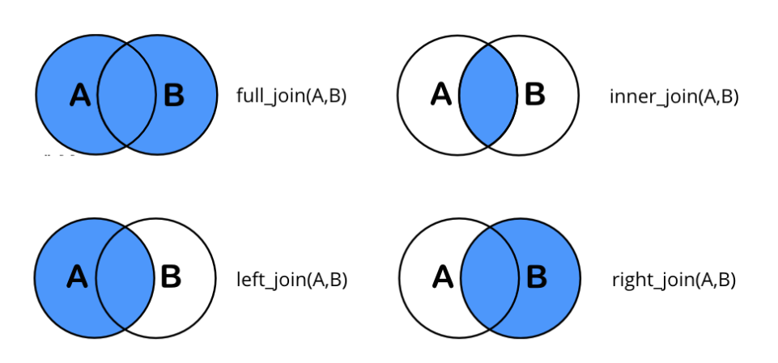
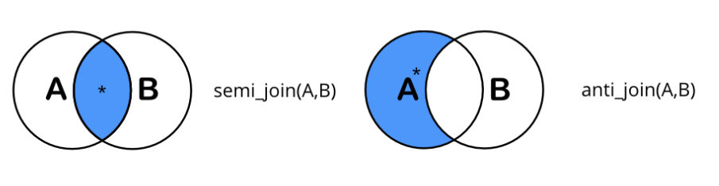

```{js, echo=FALSE}
var editor_font = "18px";   //修改代码区块的字体大小
$(function() {
   $('.ace_editor').each(function( index ) {
     ace.edit(this).setFontSize(editor_font); 
   });
})
```

```{css, echo=FALSE}
:root {
    --body-font: 16px;      /*修改文本的字体大小*/
}
a:hover { color: red;  }
body, .ace-tm {
    /*font-family: "Ubuntu Mono", "NSimSun", "SimSun", "SimHei", monospace !important;*/
    font-size: var(--body-font) !important;
}
label { display: flex !important; align-items: center}
label > span {padding-left: 5px; }
label > input {top: unset !important; }
.tutorialTitle { color: #91a01e; }
h2 { color: #ed1f7f; font-size: 2em; }
h3 { color: #005587; font-size: 1.5em; }
details > summary { display: list-item; }
details {
    border: 1px solid #aaa;
    border-radius: 0.2rem;
    padding: 0.5em 0.5em 0;
}
```

------------------------------------------------------------------------

## 学习目标

> -   学习使用`DBI`从本地数据库读取和存入数据
> -   `dplyr`的表关联操作

```{r setup}
pacman::p_load(here)
source(here(getwd(), 'www', 'setup.R'))
# 这个数据有点大, 所以我没有把它放到数据库里
flights <- nycflights13::flights
# 我们先把数据库加载进来, 后端引擎是sqlite (connection)
con <- DBI::dbConnect(drv=RSQLite::SQLite(), dbname=here(getwd(), 'www', 'buad345.db'))
# 我们再创建一个假数据, 方便我们存入数据库
salary <- tibble(
  id = c(1, 2, 3),
  name = c("John", "Jane", "Michael"),
  age = c(25, 30, 35),
  salary = c(50000, 60000, 70000)
)
if (dbExistsTable(con, 'test_salary')) { dbRemoveTable(con, 'test_salary') }
```

------------------------------------------------------------------------

## 数据库

```{r, echo=F}
countdown(minutes=10, seconds=0, update_every=1, start_immediately=F, top=0, font_size='1em')
```

> -   简介
> -   增删减查
> -   配合`dplyr`函数

### 动机

使用数据库的好处如下：

1.  与`r fa('database')`SQL工程师更方便合作，提高工作效率。
2.  数据库将相关数据集中管理，便于数据管理。 对于大数据集，数据库可通过索引实现更快速的查询和修改（本课程不包含此内容）。 避免由于使用不同读取方法（如\`read.csv和read_csv）导致的数据不一致性，直接从准备好的数据库中读取数据，确保一致性。

```{r show_global, exercise=TRUE}
# 可以发现这两个对象是全局可见的
ls()
```

::: {.alert .alert-info}
本章节介绍的函数都来自于DBI这个包。如果没有特别说明，默认情况下`function`指代`DBI::function`
:::

### 连接和断开数据库

使用`dbConnect`与某个数据库对象创建一个R同数据库之间的对话. 这里可以包括很多

### 数据库引擎 {.tabset}

#### Sqlite

``` r
install.packages("RSQLite")

# 1. 数据存放在内存里
con <- dbConnect(RSQLite::SQLite(), ":memory:")

# 2. 数据存放在文件里
con <- dbConnect(drv=RSQLite::SQLite(), dbname='./www/buad345.db')
```

#### MySQL

``` r
install.packages("RMariaDB")

# Connect to my-db as defined in ~/.my.cnf
con <- dbConnect(RMariaDB::MariaDB(), group = "my-db")
```

#### Mongo DB

``` r
install.packages("odbc")

con <- dbConnect(
  odbc::odbc(),
  Driver        = "[your driver's name]",
  Server        = "[your server's path or name]",
  Port          = 27017,
  Database      = "[your database's name]",
  AuthMechanism = "SCRAM-SHA-1", # <- Example, depends server's auth setup
  UID           = rstudioapi::askForPassword("Database user"),
  PWD           = rstudioapi::askForPassword("Database password")
)
```

当我们成功建立了`r fa('r-project')`同数据库之间的连接后, 我们便可以直接在R中调用函数执行数据库操作

-   `dbListTables`: 输出数据库存放的所有表
-   `dbListFields`: 输出某一个表的所有变量
-   `dbDisconnect`: 断开数据库连接

```{r list_table, exercise=TRUE}
dbListTables(con)
dbListFields(con, 'lab2_poll')
```

### 增加

-   `dbWriteTable`: 在数据库中写入一个新的数据表, 请输入`?dbWriteTable`来阅读它的说明
    -   `overwrite`(默认FALSE): 如果数据表同名, 是否覆盖
    -   `append`(默认FALSE): 如果数据表同名, 是否续写
-   `dbExistsTable`: 检查数据库是否包含某一个数据表

`r fa('question')` 假设现在我们有一个数据`salary`, 我们希望把它写进数据库, 并且命名为`test_salary`

```{r add_table, exercise=TRUE}
# write your code below

dbExistsTable(con, 'test_salary')
```

```{r add_table-check}
TRUE
```

```{r prepare-table}
dbWriteTable(con, 'test_salary', salary, overwrite=TRUE)
```

-   `dbWriteTable`: 当如果我们传入 `append=TRUE`，就相当于向数据表添加行
-   `dbGetQuery`: 当传入 **SQL SELECT** 语句来获得某些信息

`r fa('question')` 下面我们给`salary`数据表增加两行

```{r write_table, exercise=TRUE, exercise.setup='prepare-table'}
(before_add_row <- dbGetQuery(con, 'SELECT COUNT(*) FROM test_salary;')[[1]])
new_salary <- salary <- tibble(
  id = 4:5,
  name = c("Bob", "Alice"),
  age = c(54, 24),
  salary = c(5000, 30000)
)
# write your code below

(after_add_row <- dbGetQuery(con, 'SELECT COUNT(*) FROM test_salary;')[[1]])
```

```{r write_table-check}
5
```

### 删除

-   `dbExecute`: 当传入 **SQL INSERT/UPDATE/DELETE** 语句来更新某个数据表时
-   `dbRemoveTable`: 从数据库中删除某个数据表

`r fa('question')` 请从数据表中将`test_salary`这个数据表删除

```{r remove_table, exercise=TRUE, exercise.setup='prepare-table'}
# write your code below
dbRemoveTable(con, 'test_salary')
dbExistsTable(con, 'test_salary')
```

```{r remove_table-check}
FALSE
```

`r fa('question')` 请删除`test_salary`的第1和第3行

```{r delete_table, exercise=TRUE, exercise.setup='prepare-table'}
(before_delete_row <- dbGetQuery(con, 'SELECT COUNT(*) FROM test_salary;')[[1]])

(after_delete_row <- dbGetQuery(con, 'SELECT COUNT(*) FROM test_salary;')[[1]])
```

```{r delete_table-solution}
dbExecute(con, 'DELETE FROM test_salary WHERE id in (1,3)')
```

```{r delete_table-check}
1
```

### 使用`dplyr`语句

-   使用`tbl()`引用数据库中的某个数据表
-   接下来我们便可以对这个数据表对象进行**增删查减**
-   使用`show_query`返回`dplyr`函数所对应的**SQL**表达式[^1]
-   使用`collect()`将**SQL**语句返回的结果提取到当前的`r fa('r-project')`中, 这样才真正返回了一个可以被进一步分析的数据

[^1]: 注意这个SQL表达式可能是尚未被优化过的, 你可以将它交给专门的SQL工程师做进一步优化

```{r dplyr_tbl, exercise=TRUE}
(poll <- tbl(con, 'lab2_poll'))
```

```{r dplyr_tbl-hint-1}
poll %>% group_by(industry) %>%
  filter(year==2020, rank >= 0) %>%
  slice_min(rank, n = 1) %>% 
  ungroup() -> sql_res
```

```{r dplyr_tbl-hint-2}
poll %>% group_by(industry) %>%
  filter(year==2020, rank >= 0) %>%
  slice_min(rank, n = 1) %>% 
  ungroup() -> sql_res
sql_res %>% collect()
```

## 联表(1)

```{r, echo=F}
countdown(minutes=10, seconds=0, update_every=1, start_immediately=F, top=0, font_size='1em')
```

> mutate join: left/right/inner/full join

下面是`nycflights13`中的几个数据表, 表与表之间的关系如下

{width="50%"}

为了方便讲解，我们使用数据库中的`join_addr`和`join_phone`数据表来说明它们的用法

### mutate join {.tabset}

{width="50%"}

我们先把数据从数据库中提取到`r fa('r-project')`中

::: {style="column-count: 2;"}
<div>

```{r}
(addr <- tbl(con, 'join_addr') %>% collect() %>% as_tibble())
```

</div>

<div>

```{r}
(phone <- tbl(con, 'join_phone') %>% collect() %>% as_tibble())
```

</div>
:::

-   `inner_join`: 只有`by`那一列相等的结果才会有所保留[^2]
-   `left_join`: 保留左表中的观察值
-   `right_join`: 保留右表中的观察值
-   `full_join`: 保留左右表中的所有观察值

[^2]: 默认情况下使用所有列名相同的作为匹配键

#### inner join

::: {style="column-count: 2;"}
<div>

```{r}
dplyr::inner_join(addr, phone)
```

</div>

<div>

```{r}
base::merge(addr, phone, all=FALSE)
```

</div>
:::

#### left join

::: {style="column-count: 2;"}
<div>

```{r}
dplyr::left_join(addr, phone)
```

</div>

<div>

```{r}
base::merge(addr, phone, all.x=TRUE)
```

</div>
:::

#### right join

::: {style="column-count: 2;"}
<div>

```{r}
dplyr::right_join(addr, phone)
```

</div>

<div>

```{r}
base::merge(addr, phone, all.y=TRUE)
```

</div>
:::

#### full (outer) join

::: {style="column-count: 2;"}
<div>

```{r}
dplyr::full_join(addr, phone)
```

</div>

<div>

```{r}
base::merge(addr, phone, all=TRUE)
```

</div>
:::

### `r fa('microscope')` 练习

1.  计算每一个飞机场的平均晚点程度(`average arr_delay`)

```{r mutate_join1, exercise=TRUE}

```

```{r mutate_join1-solution}
(result <- flights %>%  
   group_by(dest) %>% 
   summarize(delay=mean(arr_delay, na.rm=T)) %>%  
   inner_join(airports,by=join_by(dest==faa)))
```

2.  飞机的机龄与晚点程度之间是否有关联

```{r mutate_join2, exercise=TRUE}

```

<details>

<summary>结果</summary>

```{r, out.width="50%"}
result <- flights %>%
   left_join(planes, by="tailnum",suffix = c("_flights","_planes")) %>%
   mutate(age=2013-year_planes) %>%
   group_by(tailnum) %>% 
   summarize(plane_delay=mean(arr_delay, na.rm=T),year=first(year_planes),age=first(age)) %>%
   filter(age >= 0) %>%
   group_by(age) %>% 
   summarize(age_delay=mean(plane_delay, na.rm=T), n=n())

result %>%  ggplot() +
  geom_point(aes(x=age,y=age_delay, alpha=n, size=n), show.legend=F) +
  scale_x_continuous("机龄", breaks = seq(0, 60, by = 10)) +
  scale_y_continuous("晚点", breaks = seq(-10, 15, by = 5))
```

从图中我们观察到平均晚点会先增加后减少. 10年机龄是一个分水岭

</details>

3.  什么样的天气条件(使用`visib`能见度这个变量)更有可能出现出发延误 (提示: 能见度这个变量范围从1到10, 使用`ggplot2::cut_interval(.data, n=10)`将连续变量离散化)

```{r mutate_join3, exercise=TRUE}

```

<details>

<summary>结果</summary>

```{r, out.width="50%"}
result <- flights %>% 
  inner_join(weather, by = c("origin","year","month","day","hour")) %>%
  mutate(visib=ggplot2::cut_interval(visib,10)) %>% 
  select(origin,month,day,dep_delay,visib) %>% 
  group_by(visib) %>% 
  summarize( delay=mean(dep_delay, na.rm=T), n=n() )

ggplot(result) + 
  geom_point(aes(x=visib, y=delay, color=visib), show.legend = F)
```

从图中我们观察到能见度越好, 晚点程度越低

</details>

<details>

<summary>dplyr\<-\>SQL</summary>

| dplyr                      | SQL                                           |
|---------------------------|---------------------------------------------|
| inner_join(x, y, by = "z") | SELECT \* FROM x INNER JOIN y USING (z)       |
| left_join(x, y, by = "z")  | SELECT \* FROM x LEFT OUTER JOIN y USING (z)  |
| right_join(x, y, by = "z") | SELECT \* FROM x RIGHT OUTER JOIN y USING (z) |
| full_join(x, y, by = "z")  | SELECT \* FROM x FULL OUTER JOIN y USING (z)  |

</details>

## 联表(2)

```{r, echo=F}
countdown(minutes=10, seconds=0, update_every=1, start_immediately=F, top=0, font_size='1em')
```

> filter join: semi_join/anti_join

{width="50%"}

::: {.alert .alert-info}
永远保留第一个表的信息, 只是某些行会被删除, 至于哪些行被删除则取决于和第二个表的关系
:::

### 例子 {.tabset}

::: {style="column-count: 2;"}
<div>

```{r}
addr
```

</div>

<div>

```{r}
phone
```

</div>
:::

-   `semi_join(x, y)`: 保留 x 中与 y 匹配的所有观察值
-   `intersect(x, y)`: x 和 y 同时包含的值
-   `anti_join(x, y)`: 删除 x 中与 y 匹配的所有观察值
-   `setdiff(x, y)`: x 中存在而 y 不存在的值

#### semi join (x, y)

::: {style="column-count: 2;"}
<div>

```{r}
dplyr::semi_join(addr, phone)
```

</div>

<div>

```{r}
addr %>% filter(name %in% intersect(addr$name, phone$name))
```

</div>
:::

#### anti join (x, y)

::: {style="column-count: 2;"}
<div>

```{r}
dplyr::anti_join(addr, phone)
```

</div>

<div>

```{r}
addr %>% filter(name %in% setdiff(addr$name, phone$name))
```

</div>
:::

### `r fa('microscope')` 练习

1.  筛选出1月份能见度大于8的所有航班

```{r filter_join1, exercise=TRUE}

```

```{r filter_join1-solution}
flights %>% semi_join(weather %>% filter(month==1, visib > 8))
```

2.  找出`flights`数据表中所有`planes`数据没有机型记录的航班

```{r filter_join2, exercise=TRUE}

```

```{r filter_join2-solution}
flights %>% anti_join(planes, by='tailnum') %>% distinct(tailnum)
```

<details>

<summary>dplyr\<-\>SQL</summary>

| dplyr           | SQL                                                                 |
|-----------------|-------------------------------------------------------|
| semi_join(x, y) | SELECT \* FROM x WHERE EXISTS (SELECT 1 FROM y WHERE x.a = y.a)     |
| intersect(x, y) | SELECT \* FROM x INTERSECT SELECT \* FROM y                         |
| anti_join(x, y) | SELECT \* FROM x WHERE NOT EXISTS (SELECT 1 FROM y WHERE x.a = y.a) |
| setdiff(x, y)   | SELECT \* FROM x EXCEPT SELECT \* FROM y                            |

</details>
